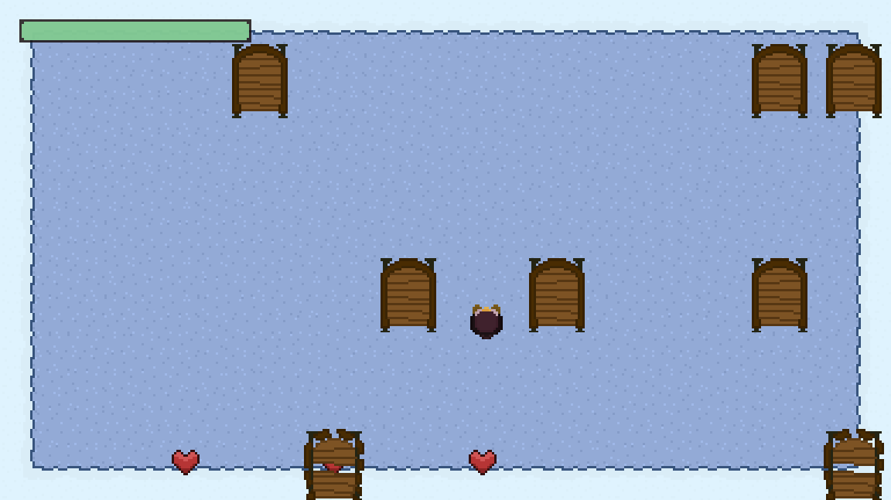
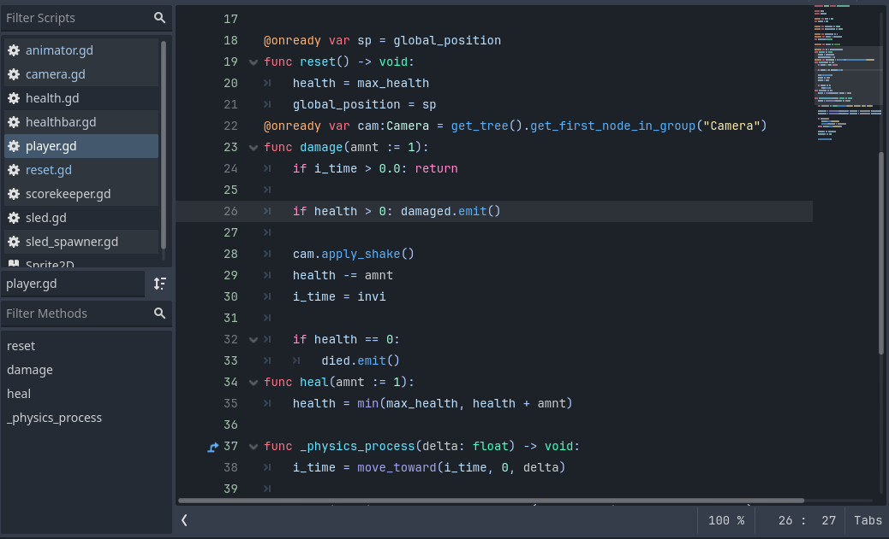
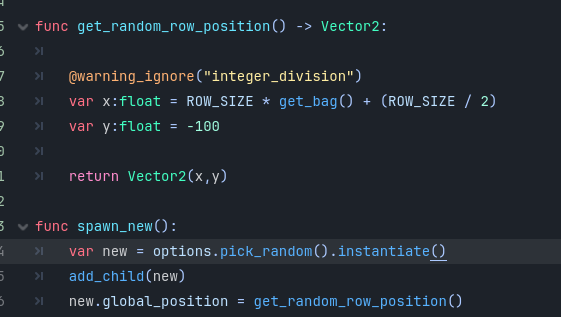
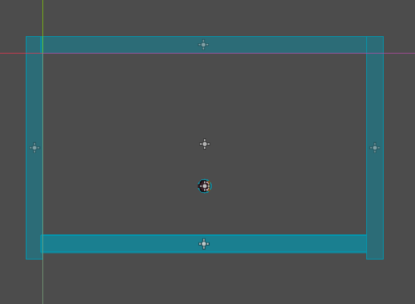
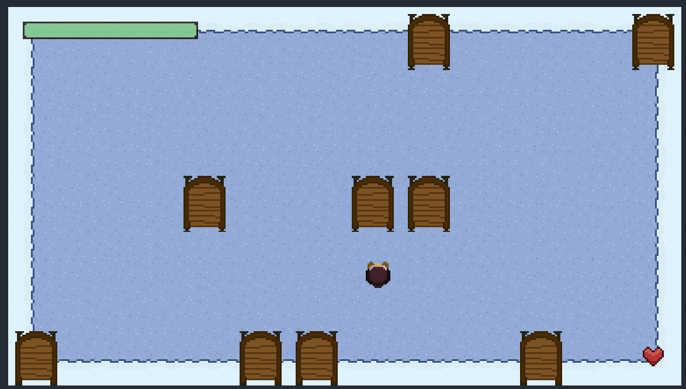
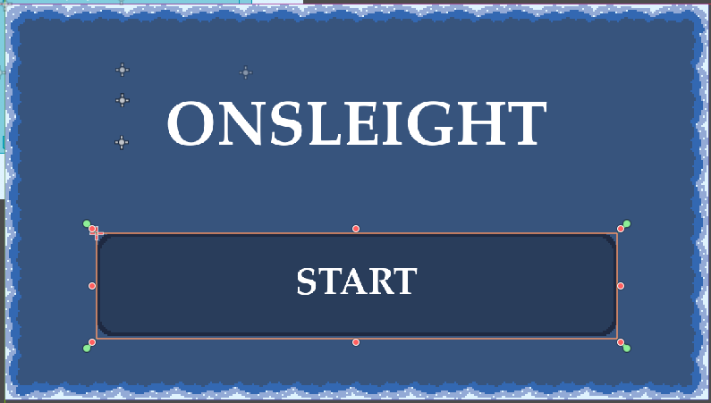
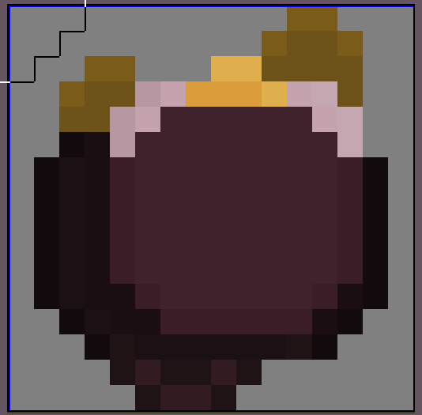

# Siege Week 9 -> Onsleight
A game where you avoid sleighs that are zipping down a hill for as long as possible.
[Theme was Winter]

<video src="https://github.com/user-attachments/assets/6ced64ec-0f2c-4cf2-8660-20c8772dc5e9" width="320" height="240" controls></video>

---
## Controls
- W/S to move forwards and backwards
- A/D to move left and right
- Play on web [here](https://baton-0.itch.io/onsleight)!

## Overview
- Made with absolutely messy code to see how much I could get done in the time limit; pure creation.
- 

## Credits
- Music is [Super Santa Claus by MintoDog](https://opengameart.org/content/super-santa-claus).
- The sled breaking sound effects are from [this](https://freesound.org/people/utsuru/sounds/183450/) and [this](https://freesound.org/people/utsuru/sounds/183452/) by utsuru. 
- Damage sound effect is [Fall to splat by jameswrowles](https://freesound.org/people/jameswrowles/sounds/248255/) with some pitch and speed changes.

---
## Devlogs
### Tuesday -> Sleds & Sled Spawner
- Got the sleds working very basically, and made a script for spawning them in rows off screen.
### Wednesday -> Player & Better Spawning
- Made the player controller, just a basic top down controller.
- Made some big tweaks to the sled spawning, like making it pick a position from a bag so it spawns one in every row before repeating the row.
- 
### Thursday -> Collision
- Made a StaticBody around the playspace so the player can't leave it.
- Made the sleds stop moving once they run into the player or the bottom of the screen.
- 
### Saturday -> Game Loop
- Finally locked in, and got the entire game loop working;
    - The player can take damage and knockback.
    - There's a working start menu and replay menu, which use a simple threshold shader for the transition.
    - The sleds, spawner, and player are all reset when a new round starts.
### Sunday -> Polish
- Did all of the art and animation;
    - Player animation (penguin!)
    - Sled crashing animation for when they hit something
    - Background tileset
    - UI Screens
    - Thumbnail, Banner, and Background for the Itch page
    - Health icon
    - Healthbar
    - Buttons
- 
- Got all the sound in and working;
    - Music
    - Sled Impact
    - Player Damage
    - Health (+particles)
- Added camera shake when you get hit.
- Made the music get quieter when you're on the lose screen, and it fades in from the start.